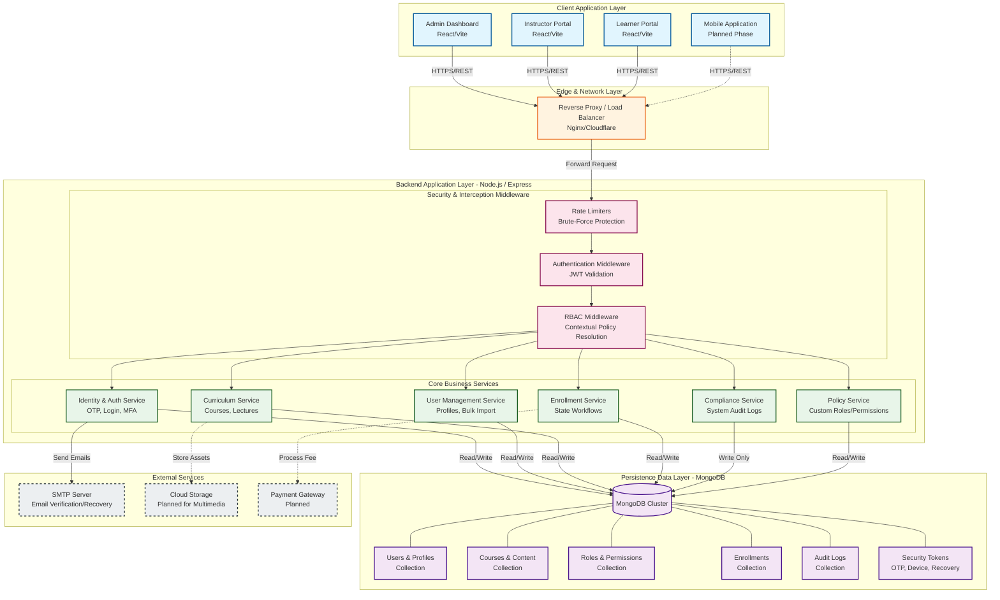

# System Architecture Diagram
**Project Name:** e-Prashikshan 2.0 (LMS)
**Classification:** Internal / Confidential

This document provides a high-level architectural overview of the e-Prashikshan 2.0 system. It maps the flow of data from the client interfaces through the security and middleware layers, into the core business logic, and finally to the persistent data storage.

