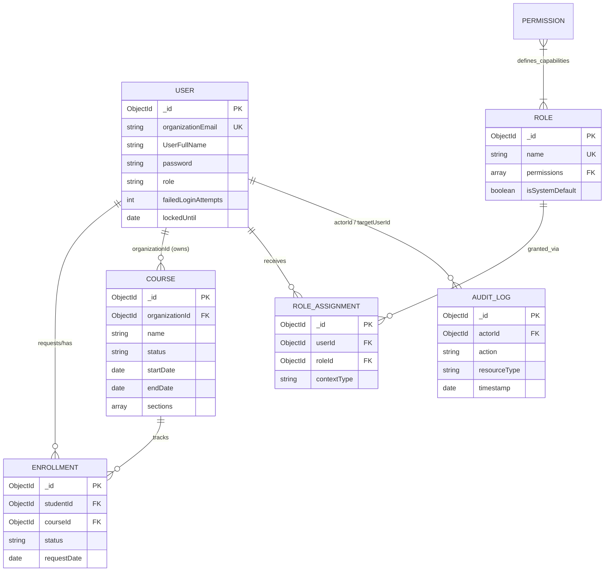

# Database Schema & Entity Relationship Definitions
**Project Name:** e-Prashikshan 2.0 (LMS)
**Classification:** Internal / Proprietary Data Models

---

## 1. Document Objective
This document outlines the core logical data models and persistence schemas governing the e-Prashikshan 2.0 application architecture. The platform utilizes **MongoDB** as its primary data store, with schemas strictly enforced at the application layer via the **Mongoose** Object Document Mapper (ODM).

---

## 2. Entity Relationship (ER) Diagram
The following architectural diagram illustrates the relational constraints and binding logic established between the core NoSQL collections.

---

## 3. Core Schema Specifications

### 3.1 User Entity (`UserModel`)
Serves as the primary identity ledger for all system actors (Institutions, Admins, Instructors, Learners).

| Field Name | Data Type | Constraints | Description |
|------------|-----------|-------------|-------------|
| `_id` | ObjectId | Primary Key | System-generated unique identifier. |
| `organizationEmail` | String | Required, Unique, Lowercase | Core authentication vector. |
| `password` | String | Required, Bcrypt Hashed | Cryptographically secured passkey. |
| `UserFullName` | String | Optional | Standard display nomenclature. |
| `role` | String | Enum | Default RBAC string (`admin`, `student`, etc.). |
| `status` | String | Enum (`active`, `suspended`) | Current account operational state. |
| `failedLoginAttempts` | Number | Default: 0 | Incremental integer for Brute-Force tracking. |
| `lockedUntil` | Date | Default: null | Enforces chronological account lockdowns. |
| `lastLoginIp` | String | Optional | Network origin tracking. |

**Indexes:** `{ organizationEmail: 1 }`, `{ role: 1 }`, `{ status: 1 }`

### 3.2 Course Curriculum Entity (`CourseModel`)
Encapsulates instructional metadata and deeply nested pedagogical content.

| Field Name | Data Type | Constraints | Description |
|------------|-----------|-------------|-------------|
| `_id` | ObjectId | Primary Key | Course identifier. |
| `organizationId` | ObjectId | Required, Ref: User | Identifies the tenant/owner of the curriculum. |
| `name` | String | Required, Trimmed | Public-facing course nomenclature. |
| `duration` | String | Required | Estimated time to completion. |
| `startDate` / `endDate` | Date | Required | Absolute temporal boundaries for course validity. |
| `instructor` | String | Required | Primary instructional point of contact. |
| `status` | String | Enum (`draft`, `published`) | Controls visibility parameters. |
| `sections` | Array [SubDocument] | - | Hierarchical grouping logic (`title`, `description`). |
| `sections.lectures` | Array [SubDocument] | - | Deepest node: `name`, `videoUrl`, `notes`. |

### 3.3 Enrollment Entity (`EnrollmentModel`)
Functions as the intersection mapping Learners (`studentId`) to Curricula (`courseId`).

| Field Name | Data Type | Constraints | Description |
|------------|-----------|-------------|-------------|
| `_id` | ObjectId | Primary Key | Enrollment record identifier. |
| `studentId` | ObjectId | Required, Ref: User | The learner requesting access. |
| `courseId` | ObjectId | Required, Ref: Course | The target instructional asset. |
| `status` | String | Enum (`pending`, `enrolled`) | State machine governing actual access. |
| `requestDate` | Date | Default: Date.now | Chronological tracking of solicitation. |

**Critical Constraints:** Implements a compound unique index on `{ studentId: 1, courseId: 1 }` explicitly prohibiting duplicate state records.

---

## 4. Security & Compliance Schemas

### 4.1 Role-Based Access Control (RBAC) Subsystem
The RBAC implementation bypasses simple string matching in favor of dynamic policy tables.
- **`Role` Collection**: Defines the aggregate policy name (e.g., "Senior Instructor") and contains an array referencing specific computational `Permissions`.
- **`Permission` Collection**: Defines granular capabilities (e.g., `course:create`, `user:delete`).
- **`RoleAssignment` Collection**: The contextual bridge. It links a specific `UserId` to a `RoleId`. Crucially, it tracks `contextType` (e.g., globally assigned vs. assigned solely within the scope of a specific `courseId`).

### 4.2 System Auditing (`AuditLog`)
Immutable compliance ledger tracking infrastructural mutations.
| Field Name | Data Type | Description |
|------------|-----------|-------------|
| `_id` | ObjectId | Primary Key |
| `actorId` | ObjectId | The identity initiating the systemic change. |
| `action` | String | Taxonomy of the event (e.g., `USER_LOGIN_FAILED`, `COURSE_PUBLISHED`). |
| `resourceType` | String | The entity classification affected (e.g., `User`, `Course`). |
| `ipAddress` | String | Network tracking for the originating request. |
| `timestamp` | Date | Absolute chronological marker. |

---

## 5. Temporal Security Collections
The system employs multiple transient collections to manage ephemeral security states, relying heavily on MongoDB's TTL (Time-To-Live) indexes to automatically purge expired documents:
1. **`OTPChallenge`**: Temporarily stores hashed multi-factor payloads and expiration vectors.
2. **`TrustedDevice`**: Binds a user's session token to a specific hardware/browser fingerprint to mitigate session hijacking.
3. **`PasswordResetToken` / `EmailVerificationToken`**: Manages cryptographic strings utilized for out-of-band identity confirmation.
